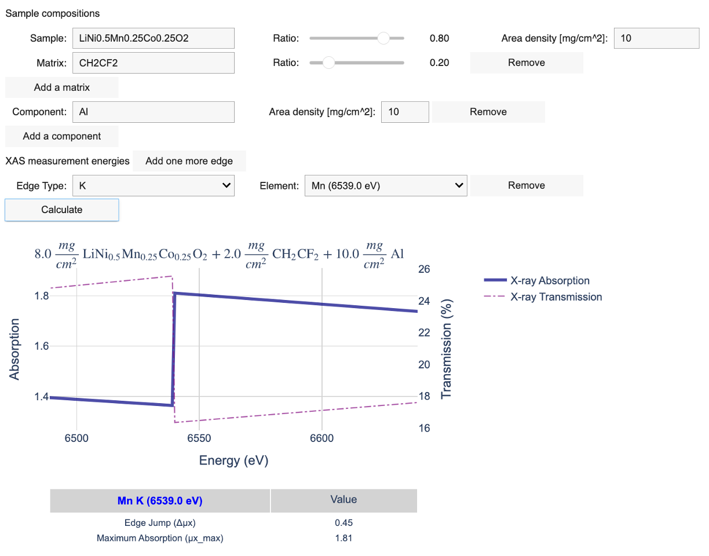

# EasyXASCalc

### Try with  or 

This is a user-friendly Jupyter notebook to calculate X-ray attenuation to optimize sample thickness for XAS measurements. 
The package is based on xraylib library. 

Juanjuan Huang
juanjuan.huang@anl.gov

